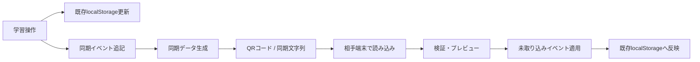

# PC・スマホ同期 設計書

関連要件: `docs/pc-mobile-sync-requirements.md`

## 1. 設計方針

PC・スマホ同期は、クラウドを使わずに、QRコードまたは同期文字列で学習データを合流させる機能として実装する。

この機能の中核は「復元」ではなく「合流」である。読み込んだ同期データで現在の `localStorage` を丸ごと置き換えない。同期データに含まれる未取り込みイベントと状態断片を、現在の端末のデータへ追加・統合する。

## 2. 全体構成



## 3. 追加する画面・導線

### 3.1 ルート

新規ページを追加する。

```text
/sync
```

想定ファイル:

```text
src/pages/DeviceSync.tsx
```

### 3.2 入口

初期実装では、設定画面の「データ管理」セクションに以下のボタンを追加する。

```text
PC・スマホ同期
```

サイドバーは既に項目が多いため、初期実装では追加しない。必要になれば後から追加する。

## 4. 追加するモジュール

```text
src/lib/sync/types.ts
src/lib/sync/device.ts
src/lib/sync/events.ts
src/lib/sync/package.ts
src/lib/sync/merge.ts
src/lib/sync/adapters.ts
src/lib/sync/codec.ts
src/components/sync/SyncQrDisplay.tsx
src/components/sync/SyncQrScanner.tsx
src/components/sync/SyncPreview.tsx
src/pages/DeviceSync.tsx
```

役割:

- `types.ts`: 同期データ型定義
- `device.ts`: `deviceId` とローカル同期メタ情報の管理
- `events.ts`: 同期イベントの追加・取得・重複排除
- `package.ts`: 同期パッケージ生成、サマリ生成
- `merge.ts`: 読み込んだ同期データの検証・統合
- `adapters.ts`: 既存 `localStorage` キーとの読み書き変換
- `codec.ts`: JSON圧縮、Base64URL化、チェックサム
- `SyncQrDisplay.tsx`: QRコード表示
- `SyncQrScanner.tsx`: カメラ読み取り
- `SyncPreview.tsx`: 読み込み前プレビュー

## 5. 依存ライブラリ

QR生成・読み取り・圧縮のため、以下の追加を推奨する。

```text
qrcode
@zxing/browser
lz-string
```

型定義:

```text
@types/qrcode
```

用途:

- `qrcode`: 同期文字列からQRコード画像を生成
- `@zxing/browser`: スマホ・PCカメラでQRコードを読み取り
- `lz-string`: JSONを圧縮し、QRコードに載せやすい文字列へ変換

## 6. localStorageキー

### 6.1 新規キー

```text
nwsp:sync:meta
nwsp:sync:events
nwsp:sync:note_meta
nwsp:sync:plan_meta
```

### 6.2 既存の同期対象キー

```text
nwsp:answer_records
nwsp:user_progress_v2
nwsp:study_sessions
nwsp:bookmarks
nwsp:question_mastery
nwsp:note_understanding
nwsp:tracker:records
nwsp:tracker:plans
nwsp:gamification
nwsp:activityLog
```

### 6.3 同期対象外キー

```text
nwsp:auth
nwsp:myAnswer:*
nwsp:savedAnswers:*
nwsp_sidebar_open
nwsp:pwa-install-dismissed
```

`nwsp:myAnswer:*` と `nwsp:savedAnswers:*` は午後問題の解答本文を含むため同期しない。午後問題は点数記録のみ同期する。

## 7. データモデル

### 7.1 SyncMeta

```ts
export interface SyncMeta {
  deviceId: string
  nextSeq: number
  knownVector: Record<string, number>
  lastCreatedAt?: string
  lastImportedAt?: string
}
```

- `deviceId`: 端末固有ID
- `nextSeq`: 次に発行するローカルイベント連番
- `knownVector`: 端末ごとに取り込み済みの最大 `seq`

`knownVector` により、同じイベントを二重に取り込まない。

### 7.2 SyncEvent

```ts
export type SyncEventType =
  | 'quiz-answer'
  | 'quiz-session'
  | 'note-understanding'
  | 'bookmark-add'
  | 'bookmark-remove'
  | 'afternoon-record'
  | 'afternoon-plan'
  | 'badge-unlock'
  | 'xp-delta'
  | 'legacy-baseline'

export interface SyncEvent<TPayload = unknown> {
  id: string
  deviceId: string
  seq: number
  type: SyncEventType
  occurredAt: string
  xpDelta: number
  payload: TPayload
}
```

`id` は以下の形式にする。

```text
<deviceId>:<seq>
```

例:

```text
phone-7f3c2a9e:123
```

### 7.3 SyncPackage

```ts
export interface SyncPackage {
  schemaVersion: 1
  app: 'nwsp-learning-app'
  createdAt: string
  fromDeviceId: string
  fromVector: Record<string, number>
  targetVector?: Record<string, number>
  summary: SyncPackageSummary
  events: SyncEvent[]
  stateFragments: SyncStateFragments
  checksum: string
}
```

### 7.4 SyncStateFragments

同期イベントだけでは表現しづらい状態を、巻き戻しが起きない形で含める。

```ts
export interface SyncStateFragments {
  noteUnderstanding?: Record<string, {
    level: 'green' | 'yellow' | 'red'
    updatedAt: string
  }>
  afternoonPlans?: Record<string, {
    date: string
    updatedAt: string
  }>
  bookmarks?: Array<{
    questionId: string
    createdAt: string
  }>
  unlockedBadgeIds?: string[]
}
```

状態断片は削除を表現しない。削除同期が必要になった場合は、後から tombstone イベントを追加する。

## 8. エンコード形式

同期文字列は以下の形式とする。

```text
NWSP-SYNC-v1:<payload>
```

`payload` の生成手順:

1. `checksum` を除いた `SyncPackage` をJSON化
2. SHA-256でチェックサムを生成
3. `checksum` を付与
4. JSON化
5. `lz-string` で圧縮
6. Base64URL互換文字列に変換
7. `NWSP-SYNC-v1:` を付ける

読み込み時は逆順で復元し、チェックサムを検証する。

## 9. 同期イベントの記録方針

### 9.1 新規学習操作

同期機能追加後は、学習操作のたびに既存データ更新と同時に `SyncEvent` を追記する。

例:

- 4択・記述の回答
- ノート理解度の変更
- 午後問題の点数記録
- 午後問題の計画日変更
- 勲章獲得
- XP獲得
- ブックマーク追加

### 9.2 既存データの初回移行

同期機能の初回利用時に、現在端末に存在するデータから `legacy-baseline` イベントを1回だけ作成する。

目的:

- 機能追加前に蓄積されたXP・勲章・記録を同期対象にする
- 初回同期時に既存学習データが失われないようにする

保存例:

```ts
{
  type: 'legacy-baseline',
  xpDelta: currentGamification.xp,
  payload: {
    answerRecords,
    studySessions,
    afternoonRecords,
    activityLog,
    unlockedBadgeIds,
    questionMastery,
    noteUnderstanding,
    bookmarks
  }
}
```

注意:

同じ学習データをすでに手動コピーして両端末に持っている場合、初回ベースライン同士の完全な重複判定はできない。以後の同期ではイベントIDにより二重取り込みを防止する。

## 10. 同期パッケージ生成

### 10.1 通常生成

`createSyncPackage(targetVector?: Record<string, number>)` を用意する。

処理:

1. 初回移行が未実施なら `legacy-baseline` を作成
2. ローカル `SyncEvent` を読み込む
3. `targetVector` がある場合、相手が未保持のイベントのみ抽出
4. `targetVector` がない場合、全イベントを含める
5. 状態断片を作成
6. サマリを作成
7. チェックサム付き同期文字列へ変換

### 10.2 PCからスマホへの返却QR

PCがスマホの同期データを読み込んだ直後は、スマホ側の `fromVector` が分かる。

返却QR生成時は、スマホの `fromVector` を `targetVector` として渡す。

```ts
const returnPackage = createSyncPackage(importedPackage.fromVector)
```

これにより、スマホが未保持のPC側イベントだけが返却QRに含まれる。

## 11. 同期データ読み込み

### 11.1 読み込み処理

`parseSyncString(input: string)`:

1. 接頭辞 `NWSP-SYNC-v1:` を確認
2. payloadを復元
3. JSON parse
4. `schemaVersion` と `app` を検証
5. checksumを検証
6. `SyncPackage` として返す

### 11.2 プレビュー作成

`buildImportPreview(pkg: SyncPackage)`:

現在の `knownVector` と照合し、実際に追加・更新される見込み数を算出する。

表示項目:

- 追加されるイベント数
- 追加される午後問題記録数
- 更新されるノート理解度数
- 追加XP
- 追加される勲章数
- 取り込み済みでスキップされるイベント数

### 11.3 確定取り込み

`applySyncPackage(pkg: SyncPackage)`:

1. 未取り込みイベントだけを抽出
2. 未取り込みイベントを `nwsp:sync:events` に追加
3. イベントを既存データへ適用
4. 状態断片をマージ
5. `knownVector` を更新
6. 派生状態を再計算
7. 完了サマリを返す

## 12. マージ設計

### 12.1 AnswerRecord

対象キー:

```text
nwsp:answer_records
```

ルール:

- `id` 単位で重複排除
- 片方にしか存在しない記録は追加
- 追加後、`answeredAt` 昇順で保持

### 12.2 UserProgress

対象キー:

```text
nwsp:user_progress_v2
```

基本方針:

`UserProgress` は `AnswerRecord` から再計算する。同期時に直接上書きしない。

再計算項目:

- `mcAttempts`
- `mcCorrect`
- `wrAttempts`
- `wrCorrect`
- `lastStudiedAt`

`isBookmarked` は `nwsp:bookmarks` から反映する。

### 12.3 QuestionMastery

対象キー:

```text
nwsp:question_mastery
```

ルール:

```text
未着手 < incorrect < correct < consecutive
```

同じ `questionId:mode` が両方にある場合は、より進んだ状態を採用する。

ただし、将来的には `AnswerRecord` から再計算する方が望ましい。

### 12.4 NoteUnderstanding

対象キー:

```text
nwsp:note_understanding
nwsp:sync:note_meta
```

ルール:

- キーは `categoryId:sectionIndex`
- `nwsp:sync:note_meta` に `updatedAt` を保持
- 同じキーが両方にある場合、`updatedAt` が新しい方を採用
- `updatedAt` がない既存データは、初回移行時刻を付与する

### 12.5 AfternoonRecords

対象キー:

```text
nwsp:tracker:records
```

ルール:

- `id` 単位で重複排除
- 片方にしか存在しない点数記録は追加
- 保存した解答本文は同期しない

### 12.6 AfternoonPlans

対象キー:

```text
nwsp:tracker:plans
nwsp:sync:plan_meta
```

ルール:

- キーは `problemId`
- `nwsp:sync:plan_meta` に `updatedAt` を保持
- 同じ `problemId` の計画日が両方にある場合、`updatedAt` が新しい方を採用
- 空文字や未設定は削除同期として扱わない。削除同期が必要な場合は別イベントを追加する

### 12.7 Bookmarks

対象キー:

```text
nwsp:bookmarks
```

初期実装:

- 和集合で統合
- `questionId` 単位で重複排除

将来対応:

- ブックマーク解除を同期したい場合、`bookmark-remove` イベントを実装する

### 12.8 ActivityLog

対象キー:

```text
nwsp:activityLog
```

ルール:

- `id` 単位で重複排除
- `createdAt` 昇順で保持
- 既存の `MAX_EVENTS = 500` は表示ログとしてはよいが、同期根拠に使うイベントは `nwsp:sync:events` に保持する

### 12.9 Gamification

対象キー:

```text
nwsp:gamification
```

基本方針:

同期後に派生状態として再構築する。

再構築元:

- 統合済み `AnswerRecord`
- 統合済み `SyncEvent`
- 統合済み `ActivityEvent`
- 統合済み勲章ID

再構築項目:

- `xp`
- `totalAnswered`
- `totalCorrect`
- `writtenCorrect`
- `currentStreak`
- `maxStreak`
- `correctQuestionIds`
- `writtenCorrectQuestionIds`
- `recentResults`
- `unlockedBadgeIds`

XPは、重複排除済みのXPイベントまたは `legacy-baseline` の `xpDelta` から合算する。勲章ボーナスXPは、同じ勲章に対して二重加算しない。

## 13. UI設計

### 13.1 ページ構成

`DeviceSync.tsx` は以下のセクションで構成する。

```text
ヘッダー
説明
1. この端末の同期データを作成
2. 相手の同期データを読み込む
3. 同期結果
```

### 13.2 同期データ作成カード

表示:

```text
この端末の同期データを作成
スマホやPCに読み込ませるためのQRコードと同期文字列を作成します。
[同期データを作成]
```

生成後:

```text
同期データを作成しました
作成日時
含まれるイベント数
含まれる午後問題記録数
含まれるXP
[同期文字列をコピー]
QRコード
同期文字列
```

### 13.3 読み込みカード

表示:

```text
相手の同期データを読み込む
[QRコードを読み取る]
[同期文字列を貼り付ける]
```

貼り付け入力:

```text
同期文字列を貼り付けてください
[内容を確認]
```

### 13.4 プレビュー

統合前に必ず表示する。

```text
読み込む同期データ
作成端末
作成日時
追加されるイベント数
追加される午後問題記録数
追加XP
追加される勲章
スキップされる取り込み済みイベント
[同期する]
[キャンセル]
```

### 13.5 完了表示

```text
同期が完了しました
追加されたイベント数
更新された状態数
追加XP
追加された勲章
```

PC側でスマホ同期データを読み込んだ後は、返却QR生成を促す。

```text
スマホにもPCの学習データを反映するには、返却用QRコードをスマホで読み込んでください。
[スマホへ返す同期QRを作成]
```

### 13.6 QR読み取りUI

- カメラ起動はユーザが `QRコードを読み取る` を押した後に行う
- カメラ権限エラー時は同期文字列貼り付けを案内する
- 読み取り成功後は自動でプレビューへ進む

## 14. エラー設計

### 14.1 形式不正

条件:

- 接頭辞が違う
- payload復元に失敗
- JSON parseに失敗

表示:

```text
同期データを読み込めませんでした。
文字列が正しいか確認してください。
```

### 14.2 バージョン不一致

条件:

- `schemaVersion` が `1` ではない
- `app` が `nwsp-learning-app` ではない

表示:

```text
この同期データは現在のアプリでは読み込めません。
アプリを最新版に更新してください。
```

### 14.3 チェックサム不一致

条件:

- payload復元後のチェックサムが一致しない

表示:

```text
同期データが破損している可能性があります。
もう一度同期データを作成してください。
```

### 14.4 QR容量超過

QR生成に失敗する、または文字列長が大きすぎる場合:

```text
同期データが大きいためQRコードを作成できませんでした。
同期文字列をコピーして相手の端末に貼り付けてください。
```

初期実装では複数QR分割は行わない。

## 15. 実装手順

1. `src/lib/sync` 配下に型・deviceId・メタ情報管理を追加
2. 同期イベントストアを追加
3. 既存データから `legacy-baseline` を作る移行処理を追加
4. 同期パッケージ生成・エンコード・デコードを追加
5. 読み込みプレビューとマージ処理を追加
6. 既存データ再構築アダプタを追加
7. QR表示・QR読み取りコンポーネントを追加
8. `/sync` ページを追加
9. 設定画面に導線を追加
10. 主要な学習操作に同期イベント追記を組み込む
11. PC→スマホ返却QRの差分生成を実装
12. 手動検証と重複取り込み検証を実施

## 16. テスト観点

### 16.1 正常系

- スマホ側データをPCに読み込むと、PC側にスマホの学習結果が追加される
- PC側で返却QRを生成し、スマホで読み込むと、スマホ側にPCの学習結果が追加される
- 4択正解、記述正解、午後問題記録、ノート理解度、XP、勲章が合流する

### 16.2 ロールバック防止

- PCだけで進めた学習が、スマホ同期データの読み込みで消えない
- スマホだけで進めた学習が、PC返却データの読み込みで消えない

### 16.3 二重取り込み防止

- 同じ同期文字列を2回読み込んでもXPが増えない
- 同じ午後問題記録が2件に増えない
- 同じ勲章ボーナスが二重加算されない

### 16.4 同期対象外

- `nwsp:myAnswer:*` が相手端末に作成されない
- `nwsp:savedAnswers:*` が相手端末に作成されない
- ログイン状態が同期されない

### 16.5 エラー系

- 不正文字列でエラー表示
- checksum不一致でエラー表示
- カメラ利用不可時に貼り付け導線へ誘導

## 17. 実装上の注意

- 同期処理では `localStorage.clear()` を使わない。
- 同期対象外キーをワイルドカードで誤って含めない。
- XPは現在値上書きではなく、重複排除済みイベントから合算する。
- バッジは和集合にするが、ボーナスXPは勲章ごとに一度だけ加算する。
- `activityLog` は表示用に上限があるため、同期の唯一の根拠にしない。
- QRコードに載せるため、同期対象に午後問題の解答本文を含めない。
- 初回移行後の操作は必ず同期イベントを追記する。

## 18. 未対応・将来拡張

初期実装では以下は対象外とする。

- クラウド同期
- リアルタイム同期
- 複数QR分割
- 午後問題の保存解答本文同期
- ブックマーク解除の厳密な同期
- 記録削除の同期

将来的に削除同期を扱う場合は、削除済みIDを tombstone として同期イベントに残す必要がある。
