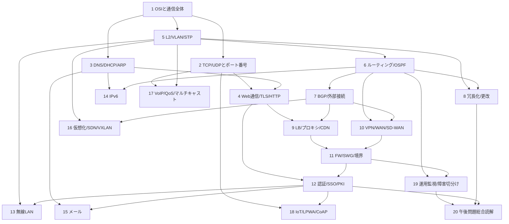

# 図解で学ぶ教科書 全体アーキテクチャ

作成日: 2026-06-14

## 1. 目的

この文書は、教科書モードの章順、学習ストーリー、章ごとの役割を定義する全体設計である。

第2章だけを設計しても、後続章との接続が弱ければ教材として成立しない。ネットワークスペシャリスト午後問題では、単独の知識ではなく、構成図、通信経路、プロトコル、セキュリティ境界、冗長化、運用変更を組み合わせて読む力が問われる。

第3章から第20章までの詳細設計は、`docs/textbook-chapters-03-20-detailed-design.md` に切り出している。実装時は、この全体アーキテクチャで章間の依存関係を確認し、章ごとの具体仕様は詳細設計書を見る。

各節の図解詳細は `docs/textbook-diagram-detail-matrix.md` で定義する。章ごとの本文実装では、本書の全体ストーリー、章別詳細設計、図解詳細マトリクスの3つをそろえて確認する。

そのため、教科書モードは次の方針で設計する。

- 章を「用語カテゴリ」ではなく「読めるようになる構成図・通信」に対応させる
- 全章を、午後問題の解答行動へ接続する
- 各章に、本文、静的図、動く図、午後問題への接続を持たせる
- 後続章で使う前提知識を、前の章で意図的に作る

## 2. 教科書全体の背骨

教科書全体は、次の6段階で進める。

| 段階 | 目的 | 対応章 |
|---|---|---|
| 1. 通信を読む土台 | レイヤ、ヘッダ、通信開始前の準備、Web通信の基本を作る | 1-4 |
| 2. 企業ネットワークの骨格 | L2、VLAN、STP、ルーティング、冗長化を構成図で読めるようにする | 5-8 |
| 3. Web系サービス経路 | LB、プロキシ、CDN、VPN、WANを、通信経路と中継装置の観点で読む | 9-10 |
| 4. セキュリティと認証 | FW、SWG、DMZ、認証、認可、PKI、SSOを境界と信頼の観点で読む | 11-12 |
| 5. 応用領域 | 無線、IPv6、メール、SDN、VoIP、IoTを、前半の見方で読む | 13-18 |
| 6. 午後問題へ統合 | 監視、障害切分け、総合構成図読解で知識を束ねる | 19-20 |

重要なのは、前半で作った見方を後半で再利用することである。たとえば、無線LAN章は電波だけの章にしない。L2、VLAN、認証、DHCP、ローミングを、前半で学んだ見方で説明する。

## 3. 章依存関係

## 4. 章別設計カード

### 第1章 OSI参照モデルと通信の全体像

役割:

- 通信をレイヤで見るための地図を作る。
- L2、L3、L4、L7が何を担当するかを最初に整理する。
- カプセル化、デカプセル化、再カプセル化を正確に理解させる。

到達状態:

- PC、L2SW、ルータ/L3SW、サーバが、どのヘッダを見て動くか説明できる。
- 各リンクではL2フレームとして運ばれ、その中にIPパケットやTCPセグメントが入ることを説明できる。
- ルータがL2を外し、IPを見て、次のリンク用L2を付け直すことを説明できる。

主要図解:

- OSI 7層の縦積み図
- カプセル化・デカプセル化の動く図
- PC-L2SW-L3SW-サーバの午後問題風構成図
- VLAN境界とL3境界の比較図

午後問題接続:

- ほぼ全問の前提。特にR7 IPv6、R6 VXLAN、R5 Web、H25 VLAN/STPに効く。

### 第2章 TCP/UDPとポート番号

役割:

- L4を、後続のDNS、HTTP、TLS、プロキシ、FW、NAT、CoAPの前提として理解させる。
- ポート番号を「端末内のどのアプリケーション/サービスに渡すかを識別する番号」として整理する。

到達状態:

- TCPとUDPの違いを、コネクション、信頼性、順序制御、オーバヘッド、用途で説明できる。
- 送信元ポート、宛先ポート、ウェルノウンポート、エフェメラルポートを区別できる。
- 5タプルで通信を識別できる。
- TCP 3ウェイハンドシェイクを構成図とヘッダ情報で追える。

主要図解:

- PC内のアプリケーションとポート番号の対応図
- TCP/UDP比較図
- TCP 3ウェイハンドシェイクの動く図
- 5タプルとパケットキャプチャ風の表

扱わない:

- HTTP、DNS、TLSの詳細。第3章・第4章で扱う。

午後問題接続:

- R7 HTTP/2とUDP保持時間、R7 IoTのCoAP、R6 PAC/プロキシ、R5 TLS/HTTP/2。

### 第3章 DNS・DHCP・ARP

役割:

- 通信開始前に必要な準備を整理する。
- 名前、IPアドレス、MACアドレスの関係を、構成図上で説明する。

到達状態:

- DNSでFQDNからIPアドレスを得る流れを説明できる。
- DHCP DORAとDHCPリレーを説明できる。
- ARPがL2フレームを作るために必要な解決であることを説明できる。
- DNSキャッシュ、TTL、A/AAAAレコードが通信経路に与える影響を説明できる。

主要図解:

- DNS問い合わせのシーケンス図
- DHCP DORAの動く図
- ARP要求が届く範囲の図
- DNS TTL変更前後比較図

午後問題接続:

- R7 DHCP/IPv6、R6メール/DNS TTL、R5マルチクラウドDNS、R4 SSO/DNS、R1 DNSセキュリティ、H26メール/SPF。

### 第4章 Web通信・TLS・HTTP

役割:

- ブラウザからWebサーバまでの通信を、時系列で追えるようにする。
- DNS、TCP、TLS、HTTPを一つの流れとして接続する。

到達状態:

- Webアクセス時のDNS、TCP、TLS、HTTPの順番を説明できる。
- TLS証明書でサーバを確認する流れを説明できる。
- HTTP/1.1とHTTP/2の大きな違いを説明できる。
- ALPNがTLSハンドシェイク中でHTTP/2選択に関係することを説明できる。

主要図解:

- DNS→TCP→TLS→HTTPの時系列図
- TLSハンドシェイクの簡略図
- HTTP/1.1とHTTP/2の比較図
- Web通信のパケットキャプチャ風図

午後問題接続:

- R7 HTTP/2、R6 CDN、R5 Web更改、R1 Web構成変更。

### 第5章 L2スイッチング・VLAN・STP

役割:

- LAN内の通信、VLANによる論理分割、L2冗長を理解させる。
- 物理構成と論理構成の違いを図で説明する。

到達状態:

- L2SWがMACアドレステーブルを見て転送することを説明できる。
- アクセスポート、トランクポート、VLANタグを説明できる。
- VLANごとのブロードキャストドメインを説明できる。
- STP/RSTPがループを防ぐ考え方を説明できる。

主要図解:

- 物理構成と論理構成の上下比較図
- VLANタグ付きフレームの図
- STPのブロックポートと障害時変化の動く図
- VLAN間ルーティング前後の図

午後問題接続:

- H25 VLAN/STP、H28データセンタVLAN、R3更改、R6 VXLAN、無線LANのVLAN収容。

### 第6章 ルーティング基礎・OSPF

役割:

- 別ネットワークへ通信するための経路選択を理解させる。
- OSPFを、用語暗記ではなく構成図上の経路制御として読ませる。

到達状態:

- 経路表、ロンゲストマッチ、デフォルトルートを説明できる。
- OSPFの隣接関係、LSA、LSDB、コスト、エリア、ABRを説明できる。
- 経路収束と障害時迂回を構成図で追える。

主要図解:

- 経路表と構成図の対応図
- OSPFエリアとABRの図
- コスト変更による経路変更の動く図
- 収束前/収束後の比較図

午後問題接続:

- R7ルータ更改、R6 SD-WAN/VXLAN、R3企業統合、H30再構築、H28企業拡張。

### 第7章 BGP・インターネット接続・外部経路制御

役割:

- インターネット接続、クラウド接続、CDN、複数ISP接続を読むためのBGPを理解させる。

到達状態:

- AS、eBGP、iBGP、経路広告、最適経路選択を説明できる。
- OSPFとBGPの役割の違いを説明できる。
- BGP経路が通信方向や可用性に与える影響を説明できる。
- 経路ハイジャックやIRRの文脈を説明できる。

主要図解:

- AS間接続図
- eBGP/iBGPの比較図
- 複数ISP接続の障害時切替図
- CDNとBGP経路の関係図

午後問題接続:

- R6 CDN、R6 VXLAN/EVPN、R5マルチクラウド、R3インターネット接続、H28 BGP、H29クラウド接続。

### 第8章 冗長化・可用性・更改作業

役割:

- VRRP、LAG、スタック、LB、経路冗長、更改時の切戻しを横断的に扱う。
- 「二重化したから安心」ではなく、何を検知し、何が切り替わり、何が残るかを理解させる。

到達状態:

- VRRPの仮想IP、マスタ/バックアップ、優先度、トラッキングを説明できる。
- L2冗長、L3冗長、サーバ冗長、回線冗長の違いを説明できる。
- 更改作業でサービス影響を抑える手順と切戻し観点を説明できる。

主要図解:

- VRRP切替の動く図
- LAG/スタック/VRRPの比較図
- 更改前後の構成比較図
- 切戻し時の通信経路図

午後問題接続:

- R7ルータ更改、R5マルチクラウド、R4テレワーク、R3更改、H26 VRRP/BFD、H27 FW負荷分散。

### 第9章 ロードバランサ・プロキシ・CDN

役割:

- Web系の中継装置を整理する。
- LB、プロキシ、CDNが、通信経路、宛先、証明書、セッション、ログにどう影響するかを理解させる。

到達状態:

- VIP、リアルサーバ、セッション維持、ヘルスチェックを説明できる。
- フォワードプロキシとリバースプロキシを区別できる。
- CONNECT、PAC、WPADを説明できる。
- CDNがDNSやBGPと関係することを説明できる。

主要図解:

- LB配下Webサーバの構成図
- プロキシCONNECTの動く図
- PACで経路が分かれる図
- CDN名前解決とキャッシュの図

午後問題接続:

- R7 SWG、R6 CDN/ローカルブレイクアウト、R5 EC/LB、R1 Web/WAF、H30 SaaS。

### 第10章 VPN・WAN・SD-WAN

役割:

- 拠点間、リモートアクセス、クラウド接続を、トンネルと経路の観点で理解させる。

到達状態:

- IPsecのIKE、ESP、トンネルモードを説明できる。
- SSL-VPNとIPsec VPNの使い分けを説明できる。
- SD-WANが下位のIP到達性に依存することを説明できる。
- VPN障害検知と経路切替を説明できる。

主要図解:

- IPsecカプセル化の図
- IKE/ESPの簡略シーケンス
- 拠点間VPNとクラウド接続の構成図
- SD-WANのアンダーレイ/オーバレイ比較図

午後問題接続:

- R6 SD-WAN、R4 SWG/IPsec、R4テレワーク、H29 SSL-VPN、H28 GRE over IPsec、H25リモート接続。

### 第11章 セキュリティ境界・FW・SWG

役割:

- FW、DMZ、WAF、IDS/IPS、SWG、ゼロトラストを、境界と通信許可の観点で理解させる。

到達状態:

- FWルールを送信元、宛先、プロトコル、ポート、方向で読める。
- NATとFWの状態管理が通信に与える影響を説明できる。
- DMZの目的を説明できる。
- SWG導入時の通信経路、証明書、ログ、FW許可を説明できる。

主要図解:

- 内部LAN/DMZ/インターネットの構成図
- FWルールと通信経路の対応図
- NATテーブルと戻り通信の図
- SWG経由Web通信の動く図

午後問題接続:

- R7 SWG、R6ローカルブレイクアウト、R4 IT/OT、R1セキュリティ、H26 FW障害、H27 IDS/IPS。

### 第12章 認証・認可・SSO・PKI

役割:

- 誰が誰を確認し、何を許可するかを、構成図とシーケンスで理解させる。

到達状態:

- 認証と認可を区別できる。
- サーバ証明書、クライアント証明書、CA、証明書チェーンを説明できる。
- SAMLのIdP/SP、KerberosのKDC/TGT/サービスチケットを説明できる。
- RADIUS/EAP-TLSの三者関係を説明できる。

主要図解:

- 証明書チェーンの図
- TLSサーバ認証とクライアント認証の比較図
- SAMLのシーケンス図
- Kerberosのシーケンス図
- RADIUS/EAP-TLSの三者図

午後問題接続:

- 認証・SSO全般。H27 SSO、R4 SSO、R5 EC/SAML、H25/H27無線認証、R7 SWGルート証明書。

### 第13章 無線LAN

役割:

- 無線LANを、電波、L2、認証、VLAN、DHCP、ローミングの組み合わせとして理解させる。

到達状態:

- AP、WLC、認証サーバ、L2SW/L3SWの役割を説明できる。
- 802.1X/EAP-TLS、証明書、認証VLANを説明できる。
- ローミングとPMKキャッシュの考え方を説明できる。
- 無線通信の帯域、干渉、周波数帯の基本を説明できる。

主要図解:

- AP/WLC/認証サーバ構成図
- 無線認証シーケンス図
- 認証結果でVLANが変わる図
- ローミング時の状態変化図

午後問題接続:

- R5高速無線LAN、H29無線LAN、H27無線LANセキュリティ、H25無線LAN導入、R1 LANセキュリティ。

### 第14章 IPv6

役割:

- IPv6をIPv4の置き換え暗記ではなく、アドレス、近隣探索、DNS、経路、監視の観点で理解させる。

到達状態:

- IPv6アドレス、プレフィックス長、リンクローカル、GUAを説明できる。
- NDP、RA、SLAAC、DHCPv6、DADを説明できる。
- A/AAAA、デュアルスタック、IPv4フォールバックを説明できる。
- IPv6監視の必要性を説明できる。

主要図解:

- IPv6アドレス構造図
- NDP/RA/SLAACのシーケンス図
- デュアルスタック時のDNSと通信選択図
- traceroute6/PMTUDの図

午後問題接続:

- R7 IPv6対応、R7ルータ更改のNAT/IPv6、R1以降のDNS/IPv6関連。

### 第15章 メール

役割:

- SMTP配送と、SPF/DKIM/DMARCをDNS・PKI・セキュリティと接続して理解させる。

到達状態:

- SMTPの配送経路を説明できる。
- SPF、DKIM、DMARCがどのDNSレコード・署名・検証で成り立つか説明できる。
- DKIM鍵漏えい時の影響を説明できる。
- C&C通信や標的型メール対策でログを見る観点を説明できる。

主要図解:

- SMTP配送経路図
- SPF/DKIM/DMARC比較表
- DKIM署名・検証の図
- DNSログとメールログの観測点図

午後問題接続:

- R6メール、H26標的型メール。

### 第16章 仮想化・クラウド・SDN/VXLAN/EVPN

役割:

- オーバレイ、アンダーレイ、制御プレーン、仮想ネットワーク機能を理解させる。

到達状態:

- 仮想サーバ移動とL2延伸の関係を説明できる。
- VXLAN、VTEP、VNI、EVPN、MP-BGPを説明できる。
- SDNコントローラの利点と単一障害点のリスクを説明できる。
- クラウド接続で経路とセキュリティ境界が変わることを説明できる。

主要図解:

- アンダーレイ/オーバレイ比較図
- VXLANカプセル化の図
- VTEP間通信の構成図
- SDNコントローラと転送装置の図

午後問題接続:

- R6 VXLAN/EVPN、H30サービス基盤、H29 SDN、H28データセンタ、H25開発システム。

### 第17章 VoIP・QoS・マルチキャスト

役割:

- 遅延、帯域、順序、配信効率が重要な通信を理解させる。

到達状態:

- SIPとRTPの役割を説明できる。
- QoS、CoS、DSCP、VLANタグとの関係を説明できる。
- マルチキャスト、IGMP、配信木を説明できる。
- 音声や映像でなぜ品質制御が必要か説明できる。

主要図解:

- SIP/RTPのシーケンス図
- QoSマーキングの図
- マルチキャスト配信木の図
- ユニキャストとマルチキャストの比較図

午後問題接続:

- R5マルチキャスト、R3通信品質、H28 IP電話、H26 IPテレフォニー。

### 第18章 IoT・LPWA・CoAP

役割:

- 制約のある端末・回線で使われる通信を、既存のL4/L7知識に接続する。

到達状態:

- LPWA、セルラー/非セルラー、ISMバンドの基本を説明できる。
- CoAPがHTTPと似た考え方を持つがUDP上で動くことを説明できる。
- DTLS、メッセージID、トークンの役割を説明できる。
- IoTシステムで省電力、再送、セキュリティをどう考えるか説明できる。

主要図解:

- IoT端末からクラウドまでの構成図
- CoAPメッセージの図
- HTTP/TCPとCoAP/UDPの比較図
- DTLS Cookieの簡略シーケンス

午後問題接続:

- R7 IoT、H30ネットワークシステム設計。

### 第19章 運用監視・障害切分け

役割:

- ここまでの知識を、障害切分けと監視に接続する。

到達状態:

- ping、traceroute、SNMP、syslog、LLDP、BFD、パケットキャプチャの使いどころを説明できる。
- HTTP死活監視とICMP監視の違いを説明できる。
- どの装置のどのログを見ればよいかを構成図から判断できる。
- 障害仮説を、事実と構成図から組み立てられる。

主要図解:

- 監視方式の比較表
- 障害切分けフローチャート
- ログ観測点付き構成図
- 正常時/障害時のパケット経路比較図

午後問題接続:

- R7ネットワーク改善、R6 CDN監視、R3運用自動化、R3インターネット接続、H28運用管理。

### 第20章 午後問題の読み方総合演習

役割:

- 章ごとの知識を、午後問題の構成図読解へ統合する。

到達状態:

- 問題文を読んだとき、まず構成図の境界、通信経路、認証点、ログ取得点を探せる。
- 設問がどのレイヤ・どの装置・どの状態を問うているか分類できる。
- 答案を、条件に即して短く説明できる。

主要図解:

- 午後問題風の総合構成図
- 設問ごとの見る場所マップ
- 変更前後・障害前後の比較図
- 答案作成の根拠線図

午後問題接続:

- 全問題。特に午後IIの長文問題に向けた総合練習。

## 5. 全章共通の図解ルール

### 5.1 各節に最低1つの図解を置く

教科書モードは「図解で学ぶ教科書」である。文章だけで説明してよい節は原則として作らない。

図解が作れない節は、次のどちらかである。

- 節の主題が曖昧
- 本文が抽象論に逃げている

その場合は、本文の前に節設計を直す。

### 5.2 図は午後問題風を基準にする

構成図は、実務寄りの美しいアイコン図ではなく、午後問題でよく見るネットワーク構成図に寄せる。

ただし、学習用として次を追加する。

- L2境界、L3境界、FW境界、認証境界の色分け
- 通信経路の強調
- 観測点のラベル
- ヘッダや状態のサイドパネル

### 5.3 動く図解は状態変化を見せる

動く図解は飾りではない。次のような、紙では理解しづらい内容に使う。

- ヘッダが付加・除去される
- 経路が切り替わる
- 状態がブロックから転送へ変わる
- 認証メッセージが複数者間を往復する
- キャッシュやセッション情報の有無で結果が変わる

### 5.4 図解は目的、形、動きを先に設計する

図解は、本文を書いた後に飾りとして追加しない。各節の実装前に、`docs/textbook-diagram-detail-matrix.md` を使って最低限次を固定する。

| 項目 | 決めること |
|---|---|
| 説明目的 | この図で何を理解させるか。どの誤解を解くか |
| 図の型 | 午後問題風構成図、シーケンス図、ヘッダ構造図、比較表、状態遷移図のどれにするか |
| 構成要素 | 機器、ネットワーク境界、サブネット、VLAN、ヘッダ、ログ、観測点として何を置くか |
| 強調対象 | どの線、境界、ヘッダ、メッセージ、状態を色や太字で強調するか |
| 動き | 動く図解の場合、各ステップで何が移動し、どのラベルや説明文が変わるか |
| 読み方 | 図の直後の本文で、どの順番に図を読ませるか |
| 表示品質 | 線と文字が重ならず、スマホ幅でも読めるか |

この設計がない図解は、実装未準備として扱う。

### 5.5 章内で未定義語を先に出さない

たとえば、第3章の前にVLANを主説明に使わない。第11章の前にDMZを当然のように出さない。必要なら、その場で最小限の定義を入れる。

## 6. 全章共通の本文ルール

### 6.1 試験用語と実務用語を分ける

試験で使う正式な表現を優先する。ただし、実務でよく見る表現も補足する。

例:

- 「認証」と「認可」は分ける
- 「IPパケット」と「Ethernetフレーム」は混同しない
- 「FWが守る」ではなく「送信元、宛先、プロトコル、ポート、方向に基づき通信を許可・遮断する」と書く

### 6.2 重要語は太字・色・表で強調する

本文を黒一色の細字だけにしない。初学者が迷う語は、表や強調で整理する。

対象:

- MAC/IP/ポート番号/FQDN/証明書/セッションID
- L2/L3/L4/L7
- 送信元/宛先
- 正常時/障害時
- 変更前/変更後

### 6.3 答案に使える短文を置く

各章の最後に、午後問題で使える表現を置く。

例:

- 「ルータは受信したL2フレームをデカプセル化し、IPヘッダの宛先IPアドレスを見て次ホップを決定する。」
- 「DNS TTLを短くすると、切替後のIPアドレスへ問い合わせ結果が反映されるまでの時間を短縮できる。」
- 「VRRPの優先度を下げることで、障害を検知した装置をマスタから外し、バックアップ側へ切り替えられる。」

### 6.4 設計判断とトレードオフを入れる

ネットワークスペシャリスト試験では、技術名を知っているだけでなく、要求、制約、運用条件を踏まえた設計判断が問われる。各章では、少なくとも一度は次の観点を本文に入れる。

| 観点 | 本文で扱うこと |
|---|---|
| コスト | 専用線、冗長化、クラウド利用、運用負荷がどう変わるか |
| 信頼性 | 単一障害点、収束時間、状態同期、切戻し可能性 |
| 安全性 | 認証、暗号化、境界分離、ログ取得、証明書信頼 |
| 性能 | 遅延、帯域、キャッシュ、HTTP/2、QoS |
| 運用性 | 設定変更範囲、監視、障害切分け、作業手順 |

本文では「便利」「安全」とだけ書かない。何を満たすために採用し、採用しない場合に何が困るかを、初学者にも読める短い言葉で説明する。

## 7. 詳細設計に入る前のゲート

各章を実装する前に、次のゲートを通す。

| ゲート | 確認内容 |
|---|---|
| ストーリー | 前章で作った前提を使っているか |
| 午後接続 | どの過去問のどの読解に効くか明示したか |
| 図解 | 全節に図解があるか |
| 図解詳細 | 図ごとの目的、図の型、構成要素、強調対象、動き、読み方を固定したか |
| 動く図 | 状態変化がある箇所に動く図を使っているか |
| 表示品質 | 線と文字の重なり、ラベルの隠れ、スマホ幅の崩れを確認したか |
| 設計判断 | コスト、信頼性、安全性、性能、運用性のいずれかのトレードオフを扱ったか |
| 正確性 | ヘッダ、経路、装置の役割、境界が正しいか |
| 日本語 | 初学者が自然に読めるか |
| 実装影響 | 教科書モード以外へ影響しないか |

このゲートを通らない章は、本文実装へ進めない。

## 8. 第2章以降の進め方

第1章と第2章の詳細設計は `docs/textbook-chapter-detailed-design.md`、第3章から第20章までの詳細設計は `docs/textbook-chapters-03-20-detailed-design.md` に整理済みである。

次工程は、章ごとに詳細設計を実装可能な図解仕様へ落とし込み、本文と図解を作ることである。各章の実装前には、次を確認する。

- 章の役割が全体ストーリーの中で明確か
- 各節に、説明目的が明確な図解があるか
- 動く図解は、状態変化やヘッダ変化など紙では見えにくいものに使われているか
- 午後問題のどの構成図読解、通信経路読解、障害切分け、変更影響に効くか
- 図解の線、文字、境界、ラベルが実際の表示で読めるか

第2章は、後続章の共通言語を作る章として、引き続き重要である。第3章以降の実装では、TCP/UDP、ポート番号、5タプル、セッション識別を必要な箇所で再利用する。

## 9. 結論

教科書モードは、次のように設計する。

- 第1章から第4章で、通信を追う基礎を作る。
- 第5章から第8章で、企業ネットワークの骨格を読む。
- 第9章から第12章で、Web、境界、VPN、認証を重ねる。
- 第13章から第18章で、応用技術を前半の見方で読み解く。
- 第19章と第20章で、障害切分けと午後問題読解へ統合する。

この全体像を前提に、各章の詳細設計を作る。章ごとの実装は、全体ストーリーの中の役割が固まってから行う。
